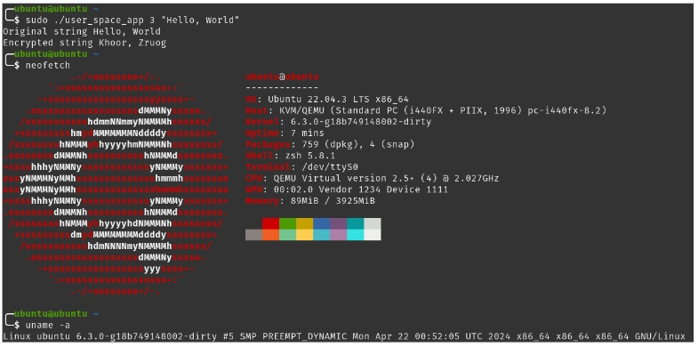

# Re-Implementing a Linux Kernel Driver in Rust

Also see parent repository: CS 594 Linux Kernel Programming @UIC <https://github.com/Rhernandez513/cs-594>



## Rust-for-Linux env setup
> Module/driver support written in Rust was integrated in kernel 6.1, all the concepts written here are applicable into any version greater or equal to 6.1
1. Download the fork of linux from Rust-for-Linux: `git clone --depth=1 https://github.com/Rust-for-Linux/linux.git` 
2. Install clang, llvm and lld: `sudo apt install clang llvm lld`
3. Install Rust: `curl --proto '=https' --tlsv1.2 -sSf https://sh.rustup.rs | sh`
4. Update the path with `source ~/.cargo/env` or `source $HOME/.cargo/env`
5. Set the required rust version used for the current kernel with `rustup override set $(scripts/min-tool-version.sh rustc)`
6. Download bindgen with `cargo install --locked --version $(scripts/min-tool-version.sh bindgen) bindgen-cli`
7. Run this command to install reaquired rust elements `rustup component add rust-src`
8. Go into linux folder and run the command `make LLVM=1 defconfig rust.config`
9. Proceed to compile the kernel with `make LLVM=1 -j4 CLIPPY=1`, where clippy is the rust linter
10. Enable support for rust-analyzer with `make LLVM=1 -j4 rust-analyzer`
11. To check whether the rust code written in the kernel is correctly formatted `make LLVM=1 -j4 rustfmtcheck`
12. To automatically format the rust code use `make LLVM=1 -j4 rustfmt`
13. To generate documentation run `make LLVM=1 -j4 rustdoc` for ease of development. To browse it go to rust/doc/kernel/index.html

## Busybox lightweight image config
1. Download busybox: `git clone --depth=1 https://github.com/mirror/busybox.git`
1. Go to busybox `cd busybox`
2. Run `make defconfig`
3. Run `make menuconfig` and enable "Build static library" under Settings-->Build
4. Build busy box with `make -j4`
5. Run `make install`
6. Go into `cd _install`
7. Run `mkdir etc`
8. Run `cp ../examples/inittab ./etc`
9. Run `vim etc/inittab` and comment out tty2 to tty5
10. Run `mkdir -p etc/init.d/`
11. Run `vim etc/init.d/rcS` and write into it
```
mkdir proc
mount -t proc none /proc
ifconfig lo up
udhcpc -i eth0
mkdir dev
mount -t devtmpfs none /dev
mkdir dev/pts
mount -t devpts nodev /dev/pts
telnetd -l /bin/sh
```
12. Make it executable with `chmod a+x etc/init.d/rcS`
13. Run `mkdir -p usr/share/udhcpc`
14. Run `cp ../examples/udhcp/simple.script usr/share/udhcpc/default.script`
15. Run `find . | cpio -H newc -o | gzip > ../ramdisk.img` to create the image
16. Boot the image running 
```sh
qemu-system-x86_64 -nographic \
-kernel $LINUX_PATH/vmlinux \
-initrd $BUSYBOX_PATH/ramdisk.img \
-nic user,model=rtl8139,hostfwd=tcp::5555-:23,hostfwd=tcp::5556-:8080
```

