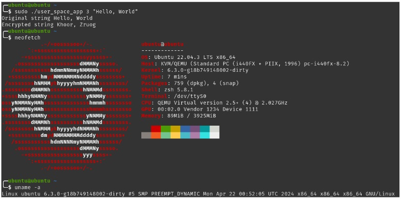

# Re-Implementing a Linux Kernel Driver in Rust


- Riccardo Strina rstrin4@uic.edu 
- Robert D. Hernandez rherna70@uic.edu
- Simone Mannarino smanna8@uic.edu 

Based partially on: [Olivier Pierre's device virtualization lab ](https://olivierpierre.github.io/virt-101/lab/03-building-qemu.html)

## Project Decision Log

- Use QEMU 8.2.1
- Use Github for collaboration and WhatsApp for real time communication
- Provide written markdown for setting up development environment, compiling, running RustC code
- Develop a RustC version of HW9

## Development Stack

- Ubuntu 22.04 LTS
- [QEMU 8.2.1](https://github.com/qemu/qemu/tree/v8.2.1)
- [Linux Kernel v6.3.0, Rust-for-Linux/linux:rust](https://github.com/Rust-for-Linux/linux/tree/rust)
- RustC v1.71
- BindGen: https://github.com/rust-lang/rust-bindgen 
- LLVM: https://llvm.org/ 
- Clang: https://clang.llvm.org/
- LLD: https://lld.llvm.org/
- rust-analyzer: https://rust-analyzer.github.io/ 
- Rust Format : https://github.com/rust-lang/rustfmt 
- RustDoc: https://doc.rust-lang.org/rustdoc/what-is-rustdoc.html 

## Code Comparison


## Runtime Results



## Rust-for-Linux env setup

> Module/driver support written in Rust was integrated in kernel 6.1, all the concepts written here are applicable into any version greater or equal to 6.1

1. Download the fork of linux from Rust-for-Linux: `git clone --depth=1 https://github.com/Rust-for-Linux/linux.git` 
2. Install clang, llvm and lld: `sudo apt install clang llvm lld`
3. Install Rust: `curl --proto '=https' --tlsv1.2 -sSf https://sh.rustup.rs | sh`
4. Update the path with `source ~/.cargo/env` or `source $HOME/.cargo/env`
5. Set the required rust version used for the current kernel with `rustup override set $(scripts/min-tool-version.sh rustc)`
6. Download bindgen with `cargo install --force --locked --version $(scripts/min-tool-version.sh bindgen) bindgen`
7. Run this command to install reaquired rust elements `rustup component add rust-src`
8. Go into linux folder and run the command `make LLVM=1 defconfig rust.config`
9. Proceed to compile the kernel with `make LLVM=1 -j4 CLIPPY=1`, where clippy is the rust linter
10. Enable support for rust-analyzer with `make LLVM=1 -j4 rust-analyzer`
11. To check whether the rust code written in the kernel is correctly formatted `make LLVM=1 -j4 rustfmtcheck`
12. To automatically format the rust code use `make LLVM=1 -j4 rustfmt`
13. To generate documentation run `make LLVM=1 -j4 rustdoc` for ease of development. To browse it go to rust/doc/kernel/index.html

## Rust Driver Source Code

```rust
//! Rust HW9 driver module
//!
//! This module is a Rust implementation of the HW9 driver module written in C.

use core::result::Result::Ok;
use kernel::bindings;
use kernel::chrdev;
use kernel::file;
use kernel::sync::Mutex;
use kernel::user_ptr::UserSlicePtr;
use kernel::{
    ioctl::{_IOR, _IOW},
    prelude::*,
    Module,
};

module! {
    type: LkpEnc,
    name: "lkp_enc",
    author: "Riccardo Strina, Robert Hernandez, Simone Mannarino",
    description: "HW9... but in Rust!",
    license: "GPL",
}

const LKP_ENC_WRITE_SEED: u32 = _IOW::<u32>('q' as u32, 1);
const LKP_ENC_WRITE_STRING: u32 = _IOW::<&str>('q' as u32, 2);
const LKP_ENC_READ_STRING: u32 = _IOR::<&str>('q' as u32, 3);

const DEVICE_BASE_PHYS_ADDR: u64 = 0xfebd1000;
const SIZE: u64 = 4096;

static DEVMEM: Mutex<usize> = unsafe { Mutex::new(0) };

struct LkpEnc {
    _dev: Pin<Box<chrdev::Registration<1>>>,
    // consider to switch to miscdev to remove DEVMEM and having it as a field in the struct
    // for more info look at the examples in the rust samples directory
    // _dev: Pin<Box<miscdev::Registration<LkpEnc>>>,
}

fn read_device(ptr: usize) -> Vec<u8> {
    let mut ret: Vec<u8> = Vec::new();
    let bound = (SIZE - 5) as usize;

    for i in 0..bound {
        let c: u8 = unsafe { bindings::ioread8((ptr + 4 + i) as _) as u8 };
        let _ = ret.try_push(c);

        if c == b'\0' {
            break;
        }
    }

    ret
}

fn write_device(ptr: usize, s: &[u8]) {
    // avoid to write in memory otherwise not handled by the device
    let device_bound:usize = (SIZE - 5) as usize;

    for (i, c) in s.iter().enumerate() {
        unsafe { bindings::iowrite8(*c, (ptr + 4 + i) as _) };

        if *c == b'\0' {
            break;
        }

        if i == device_bound {
            // if the device bound is reached write a null terminator and break
            unsafe { bindings::iowrite8(b'\0', (ptr + 4 + i) as _) };
            break;
        }
    }
}

#[vtable]
impl file::Operations for LkpEnc {
    fn open(_context: &Self::OpenData, _file: &file::File) -> Result<Self::Data> {
        Ok(())
    }

    fn write(
        _data: Self::Data,
        _file: &file::File,
        reader: &mut impl kernel::io_buffer::IoBufferReader,
        _offset: u64,
    ) -> Result<usize> {
        match reader.read_all() {
            Ok(mut s) => {
                // null terminate the string before writing it to the device
                // echo doesn't provide a null terminated string
                let _ = s.try_push(b'\0');
                write_device(*DEVMEM.lock(), &s);

                // echo will expect a different number of bytes written, adding 0 to the end
                // is not expected and will return an error
                Ok(s.len() - 1)
            }
            Err(e) => {
                pr_info!("Error reading string: {:?}", e);

                Ok(0)
            }
        }
    }

    fn read(
        _data: Self::Data,
        _file: &file::File,
        writer: &mut impl kernel::io_buffer::IoBufferWriter,
        offset: u64,
    ) -> Result<usize> {
        // If the offset is 0, it means we're starting to read from the beginning.
        // If the offset is greater than 0, in this simple case, we assume the message was already read,
        // and thus we return Ok(0) to indicate no more data is to be read.
        if offset == 0 {
            let message = read_device(*DEVMEM.lock());
            let _ = writer.write_slice(&message);

            Ok(message.len())
        } else {
            // No more data to read, indicate this by returning 0 bytes read.
            Ok(0)
        }
    }

    fn ioctl(
        _data: <Self::Data as kernel::ForeignOwnable>::Borrowed<'_>,
        _file: &file::File,
        cmd: &mut file::IoctlCommand,
    ) -> Result<i32> {
        let io_number = cmd.raw().0;
        let ptr = cmd.raw().1;
        let user_slice = unsafe { UserSlicePtr::new(ptr as _, SIZE as _) };

        match io_number {
            LKP_ENC_WRITE_SEED => {
                let seed: u32 = match user_slice.read_all() {
                    Ok(s) => {
                        if !s.is_empty() {
                            s[0] as u32
                        } else {
                            0
                        }
                    }
                    Err(e) => {
                        pr_info!("Error reading seed: {:?}", e);

                        0
                    }
                };

                unsafe {
                    bindings::iowrite32(seed, *DEVMEM.lock() as _);
                }
            }
            LKP_ENC_READ_STRING => {
                let ret = read_device(*DEVMEM.lock());

                let _ = user_slice.write_all(&ret);
            }
            LKP_ENC_WRITE_STRING => match user_slice.read_all() {
                Ok(s) => {
                    write_device(*DEVMEM.lock(), &s);
                }
                Err(e) => {
                    pr_info!("Error reading string: {:?}", e);
                    return Ok(-1);
                }
            },
            _ => {
                pr_info!("Unknown IOCTL command");
                return Ok(-1);
            }
        }

        Ok(0)
    }
}

impl Module for LkpEnc {
    fn init(name: &'static CStr, module: &'static ThisModule) -> Result<Self> {
        pr_info!("{} module init", name);

        let addr = unsafe { bindings::ioremap(DEVICE_BASE_PHYS_ADDR, SIZE) };

        // devmem know contains the address mapped in the CPU of the device

        let mut ptr = DEVMEM.lock();
        *ptr = if addr.is_null() {
            Err(ENOMEM)
        } else {
            // INVARIANT: `addr` is non-null and was returned by `ioremap`, so it is valid. It is
            // also 8-byte aligned because we checked it above.
            Ok(addr as usize)
        }?;

        let mut chardev_reg = chrdev::Registration::new_pinned(name, 0, module)?;
        chardev_reg.as_mut().register::<LkpEnc>()?;

        pr_info!("LKP_ENC_WRITE_SEED: {:?}", LKP_ENC_WRITE_SEED);
        pr_info!("LKP_ENC_READ_STRING: {:?}", LKP_ENC_READ_STRING);
        pr_info!("LKP_ENC_WRITE_STRING: {:?}", LKP_ENC_WRITE_STRING);

        Ok(LkpEnc { _dev: chardev_reg })
    }
}

impl Drop for LkpEnc {
    fn drop(&mut self) {
        pr_info!("lkp_enc module exit\n");
        unsafe { bindings::iounmap(*DEVMEM.lock() as _) };
    }
}

```

## Resources

- [Private Github Repository](https://github.com/Rhernandez513/linux-driver-in-rust)

## References / Further Reading

- [Writing Linux Kernel Modules In Rust](https://www.linuxfoundation.org/webinars/writing-linux-kernel-modules-in-rust)
- [Setting Up an Environment for Writing Linux Kernel Modules in Rust](https://www.linuxfoundation.org/webinars/setting-up-an-environment-for-writing-linux-kernel-modules-in-rust?hsLang=en)